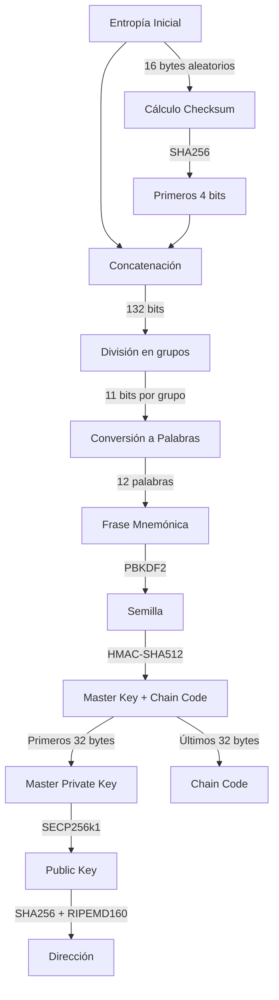
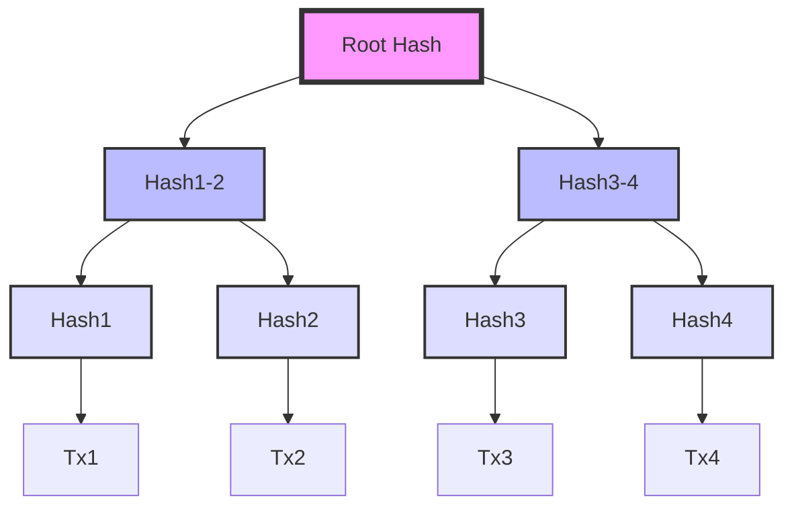
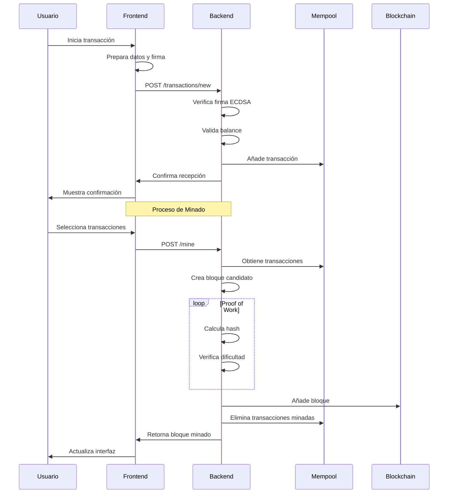
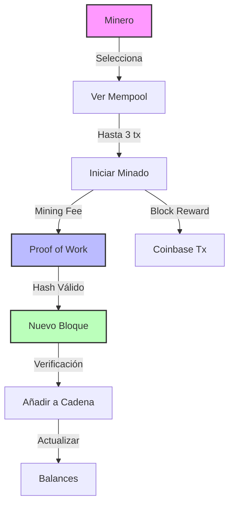
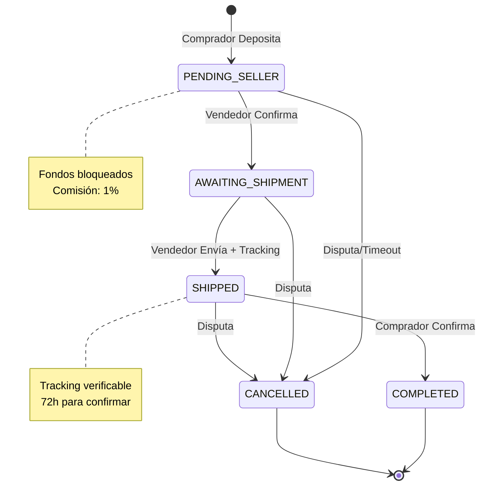
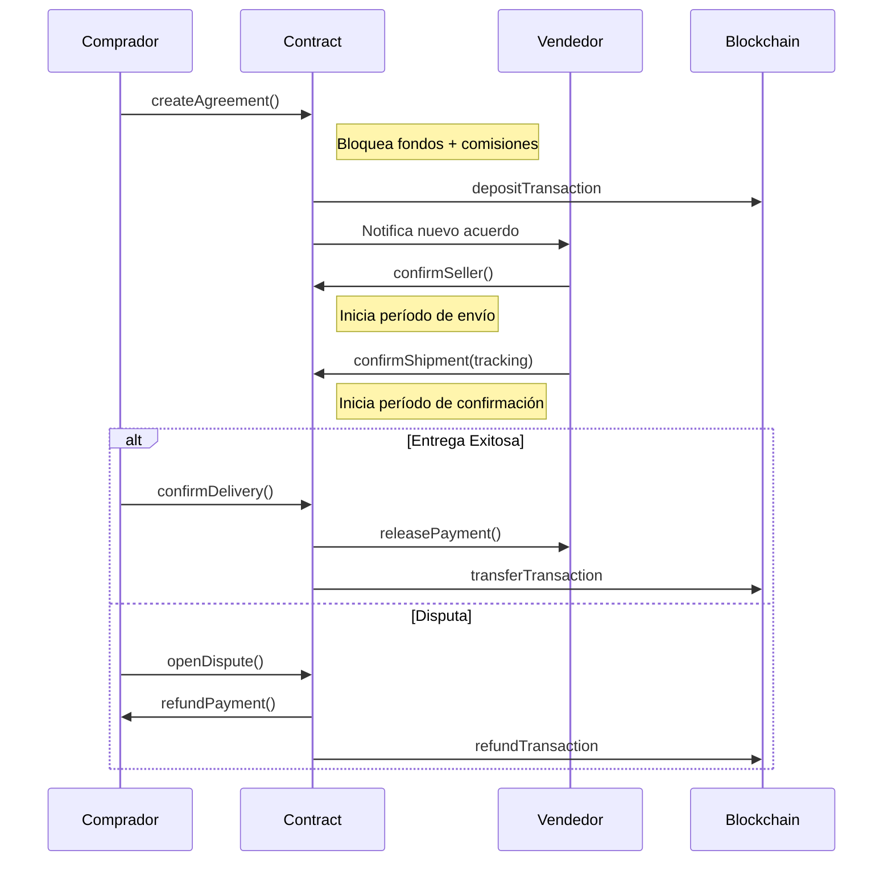
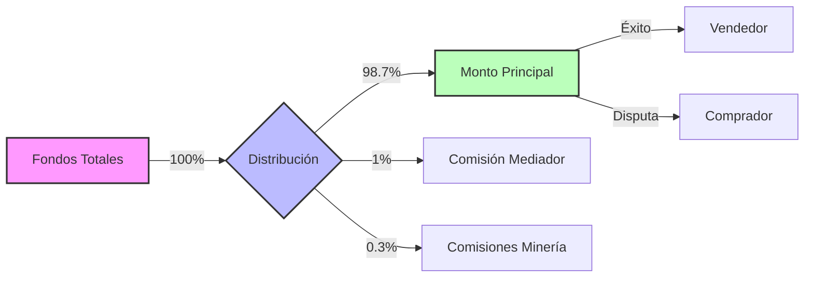
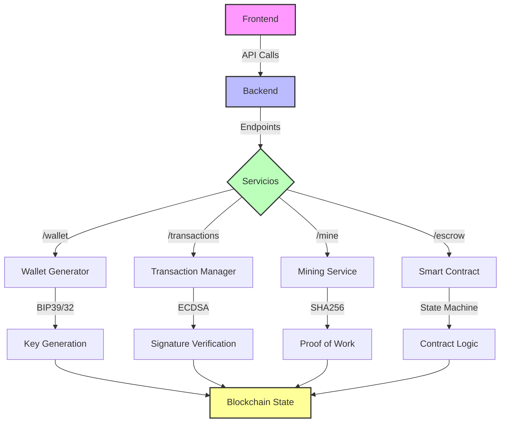

# 🔗 Análisis del Simulador Blockchain: Características, Algoritmos y Aplicaciones

## 📌 1. Introducción

El simulador blockchain implementado demuestra los conceptos fundamentales de la tecnología blockchain a través de una implementación educativa pero robusta. Esta documentación analiza sus características, algoritmos utilizados y potenciales extensiones.

## 🌟 2. Características Fundamentales de Blockchain Implementadas

### 🔄 2.1 Descentralización
El sistema implementa una cadena de bloques descentralizada donde:
- Cada bloque contiene múltiples transacciones
- La integridad se mantiene a través de hashes encadenados
- La verificación es distribuida y transparente

### 🔒 2.2 Inmutabilidad
Se garantiza mediante:
- Hashes SHA-256 para cada bloque
- Enlaces criptográficos entre bloques consecutivos
- Merkle trees para las transacciones
- Verificación completa de la cadena

### 👁️ 2.3 Transparencia
Todas las transacciones son:
- Públicamente verificables
- Permanentemente almacenadas
- Trazables a través de la cadena

## ⚙️ 3. Análisis de Componentes Principales

### 💼 3.1 Sistema de Carteras (Wallet System)

🔐 Proceso de Generación de Carteras

📝 Ejemplo Real de Generación

1. **Generación de Entropía (128 bits)**
   - Sistema genera 16 bytes de entropía seguros
   - Ejemplo: `b9607f3e17a28b93fac8d225f029a21f`

2. **Cálculo de Checksum**
   - SHA256 de la entropía produce hash completo
   - Se toman primeros 4 bits (ENT/32): `0111`

3. **Concatenación y División**
   - Se combinan entropía y checksum (132 bits)
   - Se divide en 12 grupos de 11 bits cada uno

4. **Frase Mnemónica**
   - Cada grupo se convierte en una palabra del diccionario BIP39
   - Resultado: `rich advance sorry consider chunk six twelve bottom chalk life hammer discover`

5. **Generación de Semilla**
   - PBKDF2-HMAC-SHA512 con 2048 iteraciones
   - Salt: "mnemonic"
   - Produce semilla de 64 bytes

6. **Derivación de Clave Maestra**
   - HMAC-SHA512 con clave "Bitcoin seed"
   - Genera Master Private Key y Chain Code

7. **Generación de Clave Pública**
   - Multiplicación de punto curva elíptica
   - Curva secp256k1

8. **Generación de Dirección**
   - SHA256 de clave pública
   - RIPEMD160 del resultado
   - Dirección final: `f2025103a84d2ba893fd942a8140d09520958060`

### 🌳 3.2 Merkle Tree en el Simulador

🔍 Implementación y Funcionamiento

#### 🔄 Proceso de Construcción
1. Se calcula el hash SHA256 de cada transacción individual
2. Los hashes se emparejan y se combinan
3. Proceso continúa hasta obtener un único hash (root)
4. Si hay número impar de hashes, se duplica el último

#### 🎯 Beneficios en el Simulador
- **Eficiencia**: Verificación rápida de transacciones
- **Integridad**: Detección inmediata de modificaciones
- **Pruebas de Inclusión**: Verificación sin descargar todo el bloque
- **Escalabilidad**: Estructura optimizada para grandes conjuntos de datos

### 🔄 3.3 Sistema de Transacciones y Minado

#### 3.3.1 Diagrama de Secuencia de Transacción

#### 3.3.2 Casos de Uso de Minería

### 3.4 📜 Smart Contract de Custodia (Escrow)

#### 3.4.1 Diagrama de Estados

#### 3.4.2 Diagrama de Secuencia de Operación

#### 3.4.3 Flujo de Comisiones

### 3.5 Interacción entre Componentes

## 💡 4. Aplicaciones Prácticas Detalladas

### 💰 4.1 Finanzas Descentralizadas (DeFi)

📊 Ver Aplicaciones DeFi

#### 🏦 4.1.1 Custodia de Activos
- **Sistema de Custodia Segura**
  - Contratos inteligentes verificables
  - Bloqueo temporal programable
  - Múltiples firmantes requeridos
  - Condiciones personalizables

- **Monitoreo en Tiempo Real**
  - Seguimiento de estado de fondos
  - Notificaciones de eventos
  - Auditoría completa de movimientos

#### 🔄 4.1.2 Intercambios Atómicos
- **Proceso Automatizado**
  1. Propuesta de intercambio
  2. Bloqueo de activos
  3. Verificación de condiciones
  4. Ejecución simultánea
  5. Confirmación bilateral

- **Características de Seguridad**
  - Sin custodia central
  - Cancelación automática
  - Tiempos límite configurables

#### 💳 4.1.3 Préstamos Colateralizados
- **Gestión de Préstamos**
  - Evaluación automática de garantías
  - Ratio de colateralización dinámico
  - Liquidación programada
  - Gestión de intereses

- **Características Avanzadas**
  - Multi-colateral
  - Préstamos flash
  - Refinanciación automática

#### 🏊 4.1.4 Pools de Liquidez
- **Funcionamiento**
  - Agregación de fondos
  - Market making automático
  - Distribución proporcional
  - Comisiones dinámicas

- **Innovaciones**
  - Pools concentrados
  - Múltiples niveles de riesgo
  - Incentivos para proveedores

### 📦 4.2 Supply Chain

🔍 Ver Aplicaciones en Supply Chain

#### 🔄 4.2.1 Trazabilidad
- **Seguimiento en Tiempo Real**
  - Registro de ubicación GPS
  - Condiciones ambientales
  - Tiempos de tránsito
  - Transferencias de custodia

- **Documentación Digital**
  - Certificados de origen
  - Permisos sanitarios
  - Documentos de aduana
  - Facturas comerciales

#### ✅ 4.2.2 Verificación de Autenticidad
- **Sistema de Verificación**
  - Identificadores únicos
  - Sellos digitales
  - Firmas criptográficas
  - Certificados de autenticidad

- **Prevención de Falsificaciones**
  - Marcadores físicos-digitales
  - Histórico inmutable
  - Validación multi-factor

#### 📊 4.2.3 Gestión de Inventario
- **Control Automatizado**
  - Actualización en tiempo real
  - Predicción de demanda
  - Optimización de stock
  - Alertas automáticas

- **Integración IoT**
  - Sensores RFID
  - Monitoreo ambiental
  - Control de calidad
  - Mantenimiento predictivo

#### 🏭 4.2.4 Casos de Uso Específicos
- **Farmacéutica**
  - Control de temperatura
  - Trazabilidad de lotes
  - Verificación de caducidad
  - Gestión de recalls

- **Alimentos**
  - Cadena de frío
  - Origen de productos
  - Certificaciones orgánicas
  - Información nutricional

- **Lujo**
  - Autenticación de productos
  - Historial de propiedad
  - Certificados digitales
  - Garantías verificables

### 🆔 4.3 Identidad Digital

👤 Ver Aplicaciones de Identidad

#### 📜 4.3.1 Credenciales Verificables
- **Participantes**
  - Emisores autorizados
  - Titulares de identidad
  - Verificadores confiables
  - Redes de confianza

- **Tipos de Credenciales**
  - Identidad básica
  - Títulos académicos
  - Certificaciones profesionales
  - Licencias y permisos

#### ⚡ 4.3.2 Sistema de Claims
- **Características**
  - Auto-soberanía
  - Verificabilidad
  - Privacidad selectiva
  - Revocabilidad

- **Aplicaciones**
  - KYC financiero
  - Acceso a servicios
  - Votación electrónica
  - Control de acceso

#### 🔐 4.3.3 Verificación Zero-Knowledge
- **Casos de Uso**
  - Verificación de edad
  - Prueba de solvencia
  - Validación de credenciales
  - Autenticación anónima

- **Beneficios**
  - Privacidad mejorada
  - Cumplimiento regulatorio
  - Minimización de datos
  - Protección contra fraudes

## 🚀 5. Características Potenciales y Mejoras

### 🔒 5.1 Zero-Knowledge Proofs
- zk-SNARKs para privacidad
- Transacciones confidenciales
- Pruebas de rango
- Verificación anónima

### ✍️ 5.2 Multifirma
- Esquemas m-de-n
- Carteras multifirma
- Firmas de umbral
- Gobierno corporativo

### 🤖 5.3 Inteligencia Artificial
- Detección de fraudes
- Optimización de comisiones
- Predicción de congestión
- Análisis de patrones

### 🔄 5.4 Otras Mejoras
- Sidechains para escalabilidad
- Ring signatures
- Proof of Stake
- Smart Contracts avanzados

## 📚 6. Referencias y Recursos

📖 Enlaces y Documentación

### 📑 Documentación Técnica
- [BIP39 Specification](https://github.com/bitcoin/bips/blob/master/bip-0039.mediawiki)
- [BIP32 Specification](https://github.com/bitcoin/bips/blob/master/bip-0032.mediawiki)
- [Secp256k1 Documentation](https://en.bitcoin.it/wiki/Secp256k1)

### 📚 Recursos de Aprendizaje
- [Mastering Bitcoin](https://github.com/bitcoinbook/bitcoinbook)
- [Ethereum Yellow Paper](https://ethereum.github.io/yellowpaper/paper.pdf)
- [Zero Knowledge Proofs](https://z.cash/technology/zksnarks/)

### 🛠️ Herramientas
- [BIP39 Tool](https://iancoleman.io/bip39/)
- [Blockchain Demo](https://andersbrownworth.com/blockchain/)
- [Ethereum TX Decoder](https://flightwallet.github.io/decode-eth-tx/)

---

