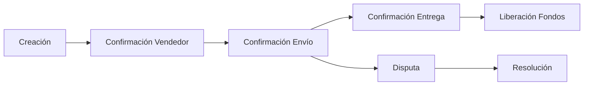

# 🔗 Análisis de Propiedades del Simulador Blockchain

## 1. Propiedades Fundamentales Implementadas

### 1.1 Consenso Distribuido
El simulador implementa un robusto sistema de consenso a través de:
- **Proof of Work (PoW)**: Sistema de minería con dificultad de 4 ceros iniciales que garantiza la validez de los bloques
- **Validación Completa**: Cada bloque nuevo es verificado por:
  - Hash del bloque anterior
  - Validez de las transacciones
  - Estructura del merkle tree
  - Dificultad del PoW
- **Mempool Priorizado**: Sistema de selección de transacciones basado en comisiones

### 1.2 Inmutabilidad y Seguridad
La seguridad del sistema se garantiza mediante múltiples capas:

```plaintext
Capas de Seguridad Implementadas:
├── 🔒 Nivel Bloque
│   ├── Hash SHA-256 para PoW
│   ├── Enlace con bloque anterior
│   └── Merkle tree de transacciones
├── 🔑 Nivel Transacción
│   ├── Firmas ECDSA/SECP256k1
│   ├── Validación de balances
│   └── Verificación de firmas
└── 💼 Nivel Wallet
    ├── Generación BIP39
    ├── Cifrado AES-256-CBC
    └── Protección PBKDF2
```

### 1.3 Trazabilidad y Transparencia
El sistema proporciona una auditoría completa mediante:

| Característica | Implementación |
|---------------|----------------|
| Historial Completo | Cada transacción queda permanentemente registrada |
| Verificación | Sistema de validación punto a punto |
| Firmas Digitales | Autenticación ECDSA de cada transacción |

## 2. Smart Contract de Custodia (Escrow)

El contrato de custodia implementado demuestra las capacidades avanzadas del sistema:

### 2.1 Flujo del Contrato


### 2.2 Características Destacadas
- **Sistema de Comisiones Inteligente**:
  - 1.0% para mediador
  - 0.1% minería inicial
  - 0.2% minería final (distribución automática)

- **Protección de Fondos**:
  - Bloqueo automático en creación
  - Liberación condicional verificada
  - Sistema de timeouts y reembolsos

## 3. Capacidades del Sistema

### 3.1 Gestión de Transacciones
El sistema implementa un sofisticado manejo de transacciones:

- **Mempool Inteligente**:
  - Priorización por comisiones
  - Límite de 3 transacciones por bloque
  - Validación previa a inclusión

- **Verificación Multinivel**:
  - Balance del emisor
  - Firma digital válida
  - Estructura correcta
  - Comisiones adecuadas

### 3.2 Sistema de Carteras
Implementación completa de carteras siguiendo estándares de la industria:

```plaintext
Funcionalidades de Wallet:
├── 🔐 Generación Segura
│   ├── Frase BIP39 (12 palabras)
│   ├── Derivación BIP32
│   └── Claves ECDSA
├── 🛡️ Protección
│   ├── Cifrado AES-256-CBC
│   ├── PBKDF2 para claves
│   └── Salt único
└── 💰 Gestión
    ├── Balance inicial 10 BBC
    ├── Historial de transacciones
    └── Verificación de firmas
```

## 4. Aplicabilidad Práctica

El simulador demuestra conceptos clave aplicables a:

### 4.1 Sistemas Financieros
- Transferencias monetarias seguras
- Sistema de comisiones dinámico
- Verificación de transacciones

### 4.2 Contratos Automatizados
- Ejecución automática de condiciones
- Sistema de custodia seguro
- Resolución de disputas

### 4.3 Educación y Desarrollo
- Demostración de conceptos blockchain
- Implementación de estándares
- Base para experimentación

## 5. Ventajas Educativas

El simulador es especialmente valioso como herramienta educativa porque:

1. **Visualización Clara**: Interfaz que muestra claramente:
   - Estructura de bloques
   - Transacciones pendientes
   - Estado de la cadena

2. **Interactividad**:
   - Minería manual
   - Creación de transacciones
   - Gestión de smart contracts

3. **Implementación Completa**:
   - Todos los componentes esenciales
   - Código bien documentado
   - Arquitectura modular

Este simulador proporciona una implementación robusta y educativa de los conceptos fundamentales de blockchain, permitiendo entender y experimentar con la tecnología de manera práctica y segura.
